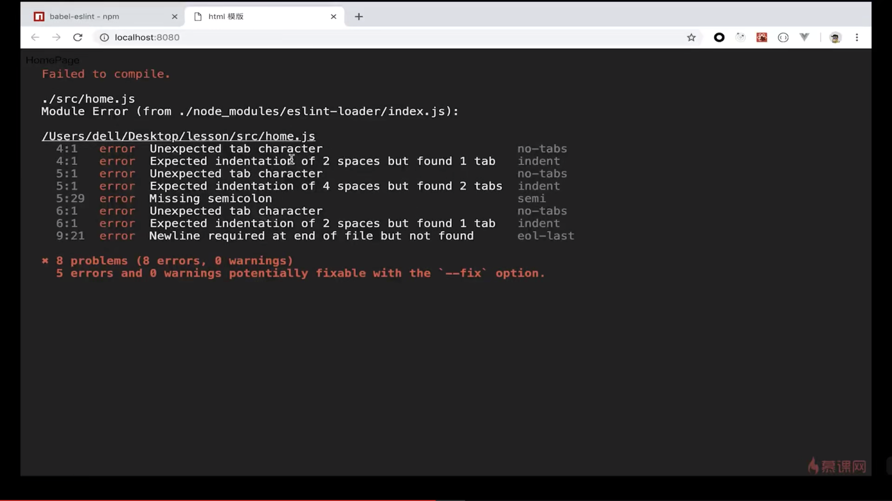

* 此章节的基础代码是5-5章节
## 5-6 Eslint在webpack中的配置（1）
```
// 安装EsLint
npm i eslint --save-dev

// 初始化eslint
npx eslint --init

...
```

## 5-7 Eslint在webpack中的配置（2）
```
// 实现webpack自动检测
// 安装EsLint loader
npm i eslint-loader --save-dev

// webpack.config.js
...
module.exports = {
  ...
  module: {
    rules: [
      {
        test: /\.js$/,
        exclude: '/node_modules/',
        use: ['babel-loader', 'eslint-loader'], // loader: 'babel-loader'   ---> use: ['babel-loader', 'eslint-loader']
      },
      ...
  },
  devServer: {
    ...
    overlay: true, // 将eslint报错显示到浏览器当中(如下图)
    ...
  },
  ...
}
```
