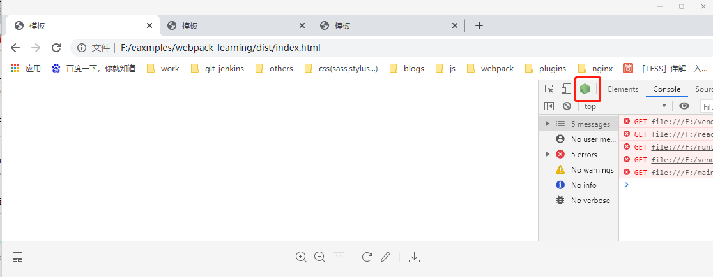

## 如何编写一个Plugin（6-1 上半节）
plugin 可以再webpack运行到某个时刻的时候，帮你做一些事情，实现原理发布订阅的模式
1. 编写一个简单的plugin--在代码打包完成，放入dist文件夹之前生成一个copyright.txt文件，一起放入dist文件夹
```
// 步骤1.
npm i webpack webpack-cli -D

// 步骤2. 创建webpack.config.js
const path = require('path');
const CopyrightWebpackPlugin = require('./plugins/copyright-webpack-plugin.js');

module.exports = {
  mode: 'development',
  entry: {
    main: './src/index.js'
  },
  plugins: [
    new CopyrightWebpackPlugin(),
  ],
  output: {
    path: path.resolve(__dirname, './dist'),
    filename: '[name].js'
  }
};

// 步骤3. 创建./plugins/copyright-webpack-plugin.js
class CopyrightWebpackPlugin {
  // compiler打包中所有的信息，配置信息等
  apply(compiler) {
    compiler.hooks // hooks[钩子]：值得是webpack打包过程中的不同阶段时暴露出来的钩子，我们可以利用这些钩子做一些处理
      .compile
      // 同步钩子的同步调用方式api
      .tap('CopyrightWebpackPlugin', (compilation) => { // compilation 只是这次打包的信息
        console.log('compile-step');
      });
    compiler.hooks
      .emit // emit: 将打包后的文件放入webpack.config.js中指定的output文件夹的时刻，这是一个异步的钩子
      // tapAsync异步钩子的同步调用方式api
      .tapAsync('CopyrightWebpackPlugin', (compilation, callback) => {
        compilation.assets['copyright.txt'] = {
          source: function() {
            return 'copyright by dell lee'; // 写入的文件内容
          },
          size: function () {
            return 28; // 设定文件大小
          }
        }
        callback();
      });
  }
}
module.exports = CopyrightWebpackPlugin;


// 步骤3. 运行npm run build
```

2. webpack打包流程调试
```
// 步骤1. 修改package.json
{
  ...
  "scripts": {
    "debug": "node --inspect --inspect-brk node_modules/webpack/bin/webpack.js",
    "build": "webpack"
  },
  ...
}
// --inspect 开始调试模式
// --inspect-brk 在webpack执行时，在第一行打一个断点2

// 步骤2. 在copyright-webpack-plugin.js中添加一个断点
class CopyrightWebpackPlugin {
  // compiler打包中所有的信息，配置信息等
  apply(compiler) {
    debugger;
    ...
  }
}
....

// 步骤3. 
npm run debug

//  步骤4. 打开浏览器,如下图一,点击红框中的node log
//  步骤5. 跳过第一个断点，就会来到第二个断点【即copyright-webpack-plugin.js中的断点】,如下图二,这样就可以看见参数中的变量值

```
图一<br/>
<br/>
图二<br/>


