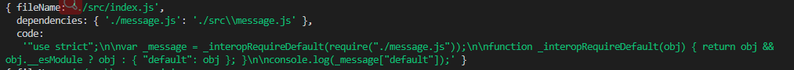
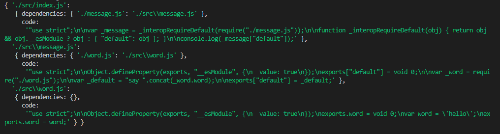
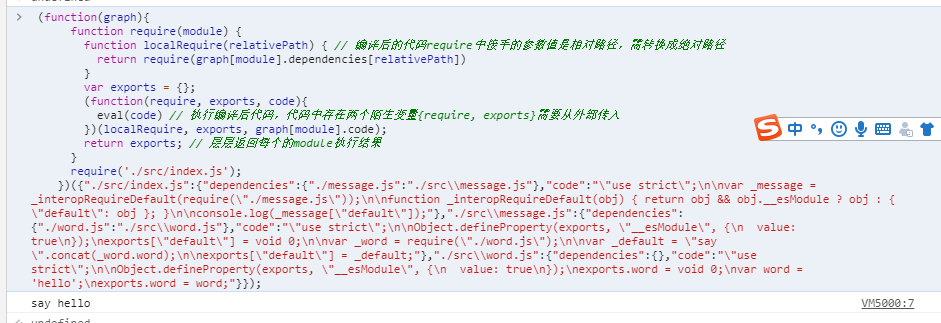

## webpack打包原理（webpack bundler theory）
这里通过实现一个简单的bundler来展示webpack代码打包原理
1. 新建一个项目文件，并安装相关依赖
```
npm init
npm i @babel/core @babel/parser @babel/preset-env @babel/traverse --save
```
2. 根目录创建文件夹src,并写部分代码
```
// src/index.js
import message from './message.js';

console.log(message);

// src/message.js
import { word } from './word.js';

export default `say ${word}`;

// src/word.js
export const word = 'hello';
```
3. 编写bundler
```
const fs = require('fs');
const path = require('path');
const parser = require('@babel/parser');
const traverse = require('@babel/traverse').default;
const babel = require('@babel/core');

// 分析module文件的依赖信息，并把module内部的代码编译es5的代码
const moduleAnalyser = (fileName) => {
  const content = fs.readFileSync(fileName, 'utf-8');
  const ast = parser.parse(content, {
    sourceType: 'module',
  }) // 抽象语法树
  const dependencies = {}; // 保存module的依赖
  traverse(ast, { // 遍历语法书
    ImportDeclaration(module) { // 遍历过程中type: 'ImportDeclaration'的module会自动调用该函数； 注：type: 'ImportDeclaration'表示module中包含import语句
      const dirName = path.dirname(fileName);
      const newFile = './' + path.join(dirName, module.node.source.value); // 依赖文件的绝对路径
      dependencies[module.node.source.value] = newFile;
    }
  });
  // 把module内部的代码编译es5的代码
  const {code} = babel.transformFromAst(ast, null, {
    presets: ['@babel/preset-env']
  }); // 编译业务代码
  const moduleInfo = {
    fileName,
    dependencies,
    code
  };
  // console.log(moduleInfo); // 如图3-1
  return moduleInfo;
}
// 生成依赖图谱
const makeDependenciesGraph = (entry) => {
  const entryModule = moduleAnalyser(entry);
  const graphArray = [entryModule]; // 依赖队列
  for (let i = 0; i < graphArray.length; i++) {
    const item = graphArray[i];
    const { dependencies } = item;
    if(dependencies) {
      for (const j in dependencies) {
        graphArray.push(
          moduleAnalyser(dependencies[j])
        )
      }
    }
  }
  // 格式化依赖队列信息，方便后面处理
  const graph = {}; 
  graphArray.forEach(({ fileName, dependencies, code }) => {
    graph[fileName] = { dependencies, code };
  });
  console.log(graph); // 如图3-2
  return graph;
}
const generateCode = (entry) => {
  const graph = JSON.stringify(makeDependenciesGraph(entry)); 
  return `
    (function(graph){
      function require(module) {
        function localRequire(relativePath) { // 编译后的代码require中接手的参数值是相对路径，需转换成绝对路径
          return require(graph[module].dependencies[relativePath])
        }
        var exports = {};
        (function(require, exports, code){
          eval(code) // 执行编译后代码，代码中存在两个陌生变量{require, exports}需要从外部传入
        })(localRequire, exports, graph[module].code);
        return exports; // 层层返回每个的module执行结果
      }
      require('${entry}');
    })(${graph});
  `;
}
const code = generateCode('./src/index.js');
// console.log(code) // 如第4点中的代码
```

图3-1<br/>
<br/>

图3-2<br/>
<br/>

4. 执行`node bundler.js`,会打印出如下代码, 粘贴复制到浏览器中执行如下图4-1
```
(function(graph){
  function require(module) {
    function localRequire(relativePath) { // 编译后的代码require中接手的参数值是相对路径，需转换成绝对路径
      return require(graph[module].dependencies[relativePath])
    }
    var exports = {};
    (function(require, exports, code){
      console.log(eval(code))
      eval(code) // 执行编译后代码，代码中存在两个陌生变量{require, exports}需要从外部传入
    })(localRequire, exports, graph[module].code);
    return exports; // 层层返回每个的module执行结果
  }
  require('./src/index.js');
})({"./src/index.js":{"dependencies":{"./message.js":"./src\\message.js"},"code":"\"use strict\";\n\nvar _message = _interopRequireDefault(require(\"./message.js\"));\n\nfunction _interopRequireDefault(obj) { return obj && obj.__esModule ? obj : { \"default\": obj }; }\n\nconsole.log(_message[\"default\"]);"},"./src\\message.js":{"dependencies":{"./word.js":"./src\\word.js"},"code":"\"use strict\";\n\nObject.defineProperty(exports, \"__esModule\", {\n  value: true\n});\nexports[\"default\"] = void 0;\n\nvar _word = require(\"./word.js\");\n\nvar _default = \"say \".concat(_word.word);\n\nexports[\"default\"] = _default;"},"./src\\word.js":{"dependencies":{},"code":"\"use strict\";\n\nObject.defineProperty(exports, \"__esModule\", {\n  value: true\n});\nexports.word = void 0;\nvar word = 'hello';\nexports.word = word;"}});
```
图4-1<br/>
<br/>
